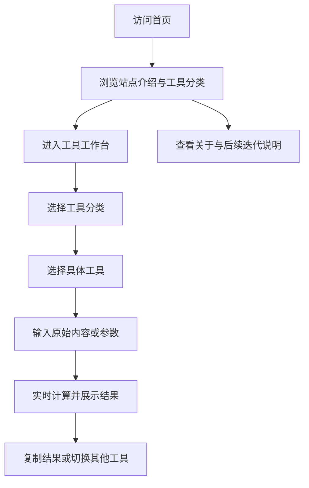

## 1. 产品概述
网络工具站 MVP 是一个面向开发者、运维人员和普通互联网用户的在线常用网络工具集合站点，提供开箱即用的查询、编码、格式化与文本处理能力。
- 目标是用简洁大方、分类清晰的界面降低用户寻找和使用网络工具的成本，并为后续持续扩展更多工具打下统一的产品框架。
- 产品价值在于聚合高频工具、减少跳转和广告干扰，形成一个可信、顺手、可持续迭代的日常效率入口。

## 2. 核心功能

### 2.1 功能模块
1. **首页**：品牌介绍、工具分类导航、推荐工具入口、站点价值说明。
2. **工具工作台页**：工具分类侧边导航、工具卡片列表、工具详情与交互面板。
3. **关于与迭代说明页**：项目定位、后续规划、反馈入口占位。

### 2.2 页面详情
| 页面名称 | 模块名称 | 功能描述 |
|-----------|-------------|---------------------|
| 首页 | 顶部导航 | 提供品牌名称、工具入口、关于页面入口与 CTA 按钮 |
| 首页 | Hero 主视觉 | 展示网站定位、简短价值主张与进入工具工作台的主按钮 |
| 首页 | 工具分类区 | 按分类展示 MVP 工具，支持快速了解工具覆盖范围 |
| 首页 | 推荐工具区 | 突出高频工具，降低首次使用门槛 |
| 首页 | 迭代路线区 | 呈现 MVP 到后续版本的能力扩展方向 |
| 工具工作台页 | 分类侧边栏 | 展示分类列表，点击后切换对应工具集合 |
| 工具工作台页 | 工具卡片列表 | 展示工具名称、简介、使用按钮与适用场景标签 |
| 工具工作台页 | 工具交互面板 | 加载并展示选中的具体工具界面与输入输出区域 |
| 工具工作台页 | 工具结果区 | 支持复制、清空、错误提示与基础交互反馈 |
| 关于与迭代说明页 | 项目介绍 | 说明产品目标、适用人群与当前 MVP 边界 |
| 关于与迭代说明页 | 后续规划 | 展示更多网络工具、账号体系、历史记录、多语言等规划 |
| 关于与迭代说明页 | 反馈入口占位 | 为未来接入邮箱、表单或社区反馈留出位置 |

### 2.3 MVP 工具清单
1. **信息查询类**
   IP 地址查询（先提供本机 IP 展示占位与常见说明，后续接真实查询服务）
2. **编解码类**
   Base64 编码/解码、URL 编码/解码
3. **文本与数据处理类**
   JSON 格式化与校验、时间戳转换
4. **开发辅助类**
   Hash 生成（MD5、SHA-1、SHA-256）、UUID 生成

## 3. 核心流程
用户进入首页后，先通过 Hero 区和分类区了解站点定位，再进入工具工作台，根据左侧分类选择具体工具，在右侧输入内容并即时得到结果，最后可复制结果继续使用。

## 4. 用户界面设计
### 4.1 设计风格
- 主色调：深海军蓝、石墨黑、暖白，搭配电光青作为交互强调色
- 按钮风格：大圆角低饱和实底按钮，悬停时带轻微发光与上浮动效
- 字体风格：标题使用具有科技感和辨识度的展示字体，正文使用清晰耐读的人文无衬线字体
- 布局风格：桌面优先，首页采用大留白分区布局，工作台页采用左侧分类 + 右侧工具面板的双栏结构
- 图标建议：使用简洁线性图标与轻量几何装饰，避免复杂拟物

### 4.2 页面设计概览
| 页面名称 | 模块名称 | UI 元素 |
|-----------|-------------|-------------|
| 首页 | Hero 主视觉 | 大字号标题、副标题、渐变光晕背景、主 CTA、辅助入口 |
| 首页 | 工具分类区 | 分类标签、工具数量提示、悬停高亮、卡片式分组 |
| 首页 | 推荐工具区 | 高优先级卡片、场景描述、快捷进入按钮 |
| 工具工作台页 | 分类侧边栏 | 吸附式导航、当前高亮、分类数量提示 |
| 工具工作台页 | 工具卡片列表 | 简介、状态标签、快速切换动效 |
| 工具工作台页 | 工具交互面板 | 多行输入框、结果框、操作按钮、错误消息、空态提示 |
| 关于与迭代说明页 | 路线图区块 | 时间线布局、卡片分期说明、简洁装饰线 |

### 4.3 响应式设计
- 采用桌面优先策略，优先保证大屏浏览和工作台高效操作体验
- 平板尺寸下双栏布局收敛为上下布局，保留分类快速切换能力
- 手机端采用折叠分类导航与单列工具面板，按钮和输入区适配触控操作
- 所有核心工具输入输出区域保证最小可点击尺寸与可读性
