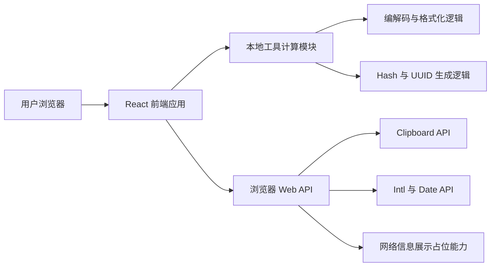

## 1. 架构设计


## 2. 技术描述
- 前端：React 18 + TypeScript + Vite
- 样式：Tailwind CSS 3 + CSS 变量体系
- 状态管理：React Hooks，本地状态优先，不引入额外全局状态库
- 路由：React Router，用于首页、工具工作台页、关于页三段式导航
- 工具实现：优先使用浏览器原生能力与前端本地算法，减少外部依赖
- 初始化工具：Vite
- 后端：无，MVP 采用纯前端静态应用方案
- 数据来源：本地静态配置 + 本地计算结果；IP 查询先采用说明型占位卡片，后续再扩展远程接口

## 3. 路由定义
| 路由 | 用途 |
|-------|---------|
| / | 首页，展示产品定位、分类与推荐工具 |
| /tools | 工具工作台页，承载分类导航与工具交互面板 |
| /about | 关于与迭代说明页，展示项目介绍与版本规划 |

## 4. 模块划分
| 模块名称 | 职责 |
|-----------|------|
| `layout` | 统一导航、页脚、页面容器与主题背景 |
| `tool-catalog` | 维护工具分类、元信息、默认排序与推荐关系 |
| `tool-renderer` | 根据当前工具类型渲染对应交互组件 |
| `tool-logic` | 提供 Base64、URL、JSON、时间戳、Hash、UUID 等工具逻辑 |
| `ui-kit` | 提供按钮、输入框、卡片、标签、分区标题等基础组件 |
| `utils` | 封装复制、日期格式化、错误提示等通用方法 |

## 5. 数据结构定义
### 5.1 工具分类定义
```ts
type ToolCategory =
  | "info"
  | "encode"
  | "data"
  | "dev";
```

### 5.2 工具元信息定义
```ts
type ToolDefinition = {
  id: string;
  name: string;
  category: ToolCategory;
  description: string;
  tags: string[];
  featured?: boolean;
};
```

### 5.3 工具结果状态定义
```ts
type ToolResultState = {
  value: string;
  error?: string;
  updatedAt?: number;
};
```

## 6. 关键实现策略
- 工具工作台采用“分类驱动 + 当前工具激活”的单页交互方式，降低页面切换成本
- 每个工具逻辑保持独立纯函数，方便后续扩展更多工具和增加测试
- JSON 格式化工具支持错误捕获与友好提示，避免页面崩溃
- Hash 与 UUID 功能优先依赖浏览器 `crypto` 能力，缺失时提供兼容提示
- 所有复制操作统一封装 Clipboard 调用与提示反馈，提升交互一致性

## 7. 性能与可维护性
- 首屏内容控制在首页介绍与推荐工具范围内，工具详情在工作台内按需渲染
- 工具元数据与 UI 配置集中管理，减少重复定义
- 组件结构遵循“页面组件 - 业务组件 - 基础组件”三级分层，便于迭代
- 保持纯前端部署兼容性，可直接部署到静态托管平台

## 8. 后续扩展方向
- 接入真实 IP 查询、DNS 查询、HTTP 状态码查询等远程接口型工具
- 增加工具收藏、最近使用、历史记录与多语言支持
- 为复杂工具引入 URL 参数持久化，支持结果分享
- 根据用户反馈逐步补充批量处理、文件导入导出与账号体系
